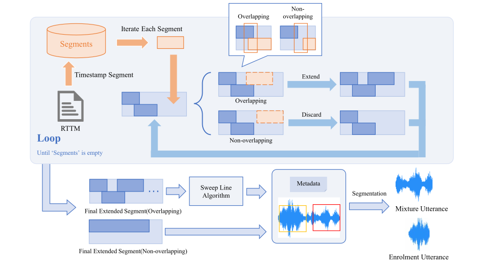

# REAL-T: Real Conversational Mixtures for Target Speaker Extraction

<p align="center">
  
</p>

<p align="center">
  <a href="xxxxxxxx">
    
  </a>
  <a href="https://real-tse.github.io/">
    
  </a>
</p>




## 1. Introduction

Target Speaker Extraction (TSE) models have demonstrated impressive performance on synthetic datasets such as **LibriMix** and **WSJMix**. However, these benchmarks lack the acoustic realism and conversational dynamics of actual human interactions — such as spontaneous speech, overlapping turns, and environmental noise — limiting their relevance to real-world scenarios.

Efforts like **REAL-M** and **LibriCSS** have attempted to bridge this gap. REAL-M collects simultaneous speech in shared environments through multi-speaker read-aloud sessions, while LibriCSS re-records isolated utterances via synchronized playback. Though valuable, these datasets still fall short of capturing the nuances of real conversations — including irregular speaker turns, sporadic utterances, and authentic background conditions.

To address these limitations, we introduce **REAL-T**, the first conversation-centric dataset specifically designed for TSE under real-world conditions. Built from speaker diarization corpora, REAL-T naturally includes overlapping speech, enrollment-ready segments, and complex conversational behaviors.

Key features of REAL-T include:

- **Multi-lingual**: English and Mandarin recordings
- **Multi-genre**: Covering diverse conversational scenarios
- **Multi-enrollment**: Multiple enrollment utterance from different parts of the conversation

REAL-T ships **DEV**, **EVAL1**, and **EVAL2** splits. All three include ground-truth references for local evaluation with `run_eval.sh`.

Evaluations reveal that existing TSE models suffer significant performance degradation on REAL-T, highlighting the need for more robust approaches tailored to real conversational speech.

For more details, refer to our paper: [REAL-T Paper](https://www.isca-archive.org/interspeech_2025/li25da_interspeech.pdf)


## 2. Installation

### 2.1 Clone the repository

```bash
git clone https://github.com/REAL-TSE/REAL-TSE-Challenge.git
cd REAL-TSE-Challenge

# install submodules (wesep + FireRedASR2S; FireRedASR2S provides FireRedVAD
# for the timing evaluation, NOT for ASR transcription. The FireRedASR
# Python package used by the optional FireRedASR-AED-L ASR backend is
# vendored under ./FireRedASR/ and does NOT need a separate clone.)
git submodule update --init --recursive
```

### 2.2 Create a Conda environment and install dependencies

```bash
conda create -n REAL-T python=3.10
conda activate REAL-T
pip install -r requirements.txt
# Reinstall GPU ORT last so silero-vad / wespeakerruntime do not leave CPU ORT active.
pip install --force-reinstall --no-deps onnxruntime-gpu==1.19.2
```

`requirements.txt` is the only supported Python dependency entrypoint for this repo. For RTX 5090 / `sm_120`, it resolves the `cu128` PyTorch wheels automatically. If you encounter any issues, try using `requirements2.txt` instead. `wespeaker` remains the only GitHub dependency because local `wesep` imports it directly.

The default ASR layer uses [`sherpa-onnx`](https://github.com/k2-fsa/sherpa-onnx) (CPU
ONNX runtime) to drive the Zipformer transducers, and
[`whisper-normalizer`](https://pypi.org/project/whisper-normalizer/) for
text normalization in TER (no Whisper checkpoint needed for normalization).
Both packages are already pinned in `requirements.txt`.

The optional Whisper-large-v2 (English) and FireRedASR-AED-L (Chinese)
ASR backends, kept for backwards compatibility with the original
configuration, rely on `transformers` / `kaldiio` / `sentencepiece` /
`kaldi-native-fbank` etc. — these are also already pinned in
`requirements.txt`, so no extra install step is needed.

All top-level scripts source `env_setup.sh` by default. That helper activates `REAL-T` and appends the local `FireRedASR` / `FireRedASR2S` / `wesep` paths automatically. If you want to use a different env name temporarily, run them with `REALT_CONDA_ENV=<your_env_name>`.

### 2.3 Set up Linux PATH and PYTHONPATH

> Please replace `$PWD` below with the absolute path to this project (REAL-T repo root).

**FireRedASR2S** (FireRedVAD, used by the timing evaluation only) and
**FireRedASR** (used by the optional `FireRedASR-AED-L` ASR backend) are
both expected under the REAL-T repo root. Initialize/update the
submodules first, then add the relevant repo roots to `PYTHONPATH`:

```
$ export PATH=$PWD/FireRedASR/fireredasr/:$PWD/FireRedASR/fireredasr/utils/:$PATH
$ export PYTHONPATH=$PWD/FireRedASR/:$PYTHONPATH
$ export PYTHONPATH=$PWD/FireRedASR2S/:$PYTHONPATH
$ export PYTHONPATH=$PWD/wesep_real_tse/:$PYTHONPATH
```

The default Zipformer ASR backend (`zipformer-en` / `zipformer-zh`)
itself does **not** require any extra `PYTHONPATH` entry — `sherpa-onnx`
is a regular pip package. The `FireRedASR` entry above is only needed
when you switch to the optional `FireRedASR-AED-L` Chinese ASR backend.


### 2.4 Prepare Dataset and Checkpoints

#### Dataset

Copy the released REAL-T split folders into `./datasets/`:

```bash
cp -r /path/to/REAL-T-dev ./datasets/REAL-T-dev
cp -r /path/to/REAL-T-eval1 ./datasets/REAL-T-eval1
cp -r /path/to/REAL-T-eval2 ./datasets/REAL-T-eval2
```

All scripts auto-detect datasets from the split directory.

#### One-Command Setup

`pre.sh` downloads model weights and regenerates `mapping.csv` for all dataset directories found under `./datasets/`:

```bash
bash -i ./pre.sh
```

`pre.sh` supports these optional download switches:

- `REALT_PREP_DOWNLOAD_ZIPFORMER_EN` (default `1`)
- `REALT_PREP_DOWNLOAD_ZIPFORMER_ZH` (default `1`)
- `REALT_PREP_DOWNLOAD_FIRERED_ASR` (default `0`)
- `REALT_PREP_DOWNLOAD_WHISPER` (default `0`)
- `REALT_PREP_DOWNLOAD_FIRERED_VAD` (default `1`)
- `REALT_PREP_DOWNLOAD_DNSMOS` (default `1`)

After a default run, model weights are prepared at:

- Zipformer-EN: `./zipformer/pretrained_models/sherpa-onnx-zipformer-gigaspeech-2023-12-12`
- Zipformer-ZH: `./zipformer/pretrained_models/sherpa-onnx-zipformer-multi-zh-hans-2023-9-2`
- FireRedVAD (timing eval only): `./FireRedASR2S/pretrained_models/FireRedVAD/VAD`
- DNSMOS ONNX: `./DNSMOS/sig_bak_ovr.onnx` and `./DNSMOS/model_v8.onnx`

Existing files are reused when possible, so repeated runs are safe. The
optional Whisper-large-v2 and FireRedASR-AED-L ASR weights are not
downloaded by default. Enable them only when you plan to run those
backends:

```bash
REALT_PREP_DOWNLOAD_WHISPER=1 REALT_PREP_DOWNLOAD_FIRERED_ASR=1 bash -i ./pre.sh
```

When enabled, the optional ASR weights are prepared at:

- FireRedASR-AED-L (optional, Chinese): `./FireRedASR/pretrained_models/FireRedASR-AED-L`
- Whisper-large-v2 (optional, English): `./whisper/pretrained_models/whisper-large-v2`

If you only need the Zipformer ASR weights without `pre.sh`, use the
standalone helper:

```bash
python utils/download_zipformer.py            # both en + zh
python utils/download_zipformer.py --only en  # only English (GigaSpeech)
python utils/download_zipformer.py --only zh  # only Chinese (multi-zh-hans)
```

Both targets are streamed from the
[k2-fsa/sherpa-onnx GitHub Releases](https://github.com/k2-fsa/sherpa-onnx/releases/tag/asr-models)
(`<release_name>.tar.bz2`, ~290 MB each), extracted into
`./zipformer/pretrained_models/<release_name>/`.

## 3. Inference and Evaluation

### 3.1 TSE Inference on REAL-T

The `run_tse.sh` script below demonstrates how to perform TSE inference with the [wesep-real-tse toolkit](https://github.com/REAL-TSE/wesep-real-tse) using a **BSRNN model** trained on **Libri2mix-100**. You can adapt its `input/output` structure to suit your own TSE model.

```bash
cd REAL-TSE-Challenge
bash -i run_tse.sh --model tfmap_context_100 --test-set DEV
```

This script runs TSE inference for multiple datasets using a specified model. Each dataset will be processed individually, generating separated target speaker audio files.

| **Argument**        | **Description**                                                                |
| :------------------ | :----------------------------------------------------------------------------- |
| `--model`           | (required) TSE model name, e.g. `tfmap_context_100`.                           |
| `--test-set`        | (required) Evaluation split: `DEV` or `EVAL1` or `EVAL2`.                      |
| `--device`          | Inference device. Default: `cuda`.                                             |
| `--model-dir`       | Directory containing model checkpoints. Default: `./pretrained`.               |
| `--dataset-root`    | Root of the REAL-T dataset. Default: `./datasets/REAL-T-{dev\|eval1\|eval2}`.  |
| `--output-root`     | Root output directory. Default: `./output`.                                    |


The checkpoints is availibale at [Google Drive](https://drive.google.com/uc?export=download&id=1M4UqK2A2EeHmQ0pCevYqBgaYn3RvklgC) . The directory structure for the pretrained models in the REAL-T project is suggested to be:

```
REAL-T/
├── pretrained/
│ ├── spk_emb_100/
│ │ ├── avg_model.pt
│ │ └── config.yaml
│ ├── spk_emb_causal_100/
│ ├── tfmap_context_100/
│ └── tfmap_context_causal_100/
```

---

### 3.2 One-Click Evaluation

The recommended evaluation entrypoint is now `run_eval.sh` at the repo root. It runs the full evaluation pipeline sequentially on one `OUTPUT_DIR`, using one CUDA device for all stages.

`run_eval.sh` supports `DEV`, `EVAL1`, and `EVAL2`. The pipeline auto-detects datasets from `*_meta.csv` in the split directory.

```bash
cd REAL-TSE-Challenge
bash ./run_eval.sh --output-dir ./output/DEV/tfmap_context_100 --test-set DEV --cuda 0
bash ./run_eval.sh --output-dir ./output/EVAL1/tfmap_context_100 --test-set EVAL1 --cuda 0
bash ./run_eval.sh --output-dir ./output/EVAL2/tfmap_context_100 --test-set EVAL2 --cuda 0
```

| **Argument**        | **Description**                                                                |
| :------------------ | :----------------------------------------------------------------------------- |
| `--output-dir`      | (required) Path to the TSE output directory to evaluate.                       |
| `--test-set`        | (required) Evaluation split: `DEV`, `EVAL1`, or `EVAL2`.                        |
| `--cuda`            | (required) CUDA device ID for GPU-accelerated evaluation.                      |
| `--chinese-asr`     | (optional) ASR model for Chinese datasets. Default: `zipformer-zh`. Other: `FireRedASR-AED-L`. |
| `--english-asr`     | (optional) ASR model for English datasets. Default: `zipformer-en`. Other: `whisper-large-v2`. |

`run_eval.sh` supports three common usages:

```bash
# 1 2: run all evaluation sub-scripts, then summarize
bash ./run_eval.sh --output-dir ./output/DEV/tfmap_context_100 --test-set DEV --cuda 0 1 2

# 1: only run all evaluation sub-scripts
bash ./run_eval.sh --output-dir ./output/DEV/tfmap_context_100 --test-set DEV --cuda 0 1

# 2: only summarize existing CSV results
bash ./run_eval.sh --output-dir ./output/DEV/tfmap_context_100 --test-set DEV --cuda 0 2
```

If no mode is provided, the default is `1 2`.

#### Switching the ASR backend (optional)

By default the TER evaluation uses `zipformer-zh` for Chinese datasets
(AISHELL-4, AliMeeting, unseen_CN) and `zipformer-en` for English
datasets (AMI, CHiME6, DipCo, unseen_EN). The original Whisper-large-v2 /
FireRedASR-AED-L pair is still available and can be selected via CLI flags:

```bash
# Reproduce the historical setup (FireRedASR-AED-L for zh, Whisper-large-v2 for en)
bash ./run_eval.sh --output-dir ./output/DEV/tfmap_context_100 --test-set DEV --cuda 0 \
    --chinese-asr FireRedASR-AED-L --english-asr whisper-large-v2

# Switch only the English side to Whisper-large-v2, keep zh on Zipformer
bash ./run_eval.sh --output-dir ./output/DEV/tfmap_context_100 --test-set DEV --cuda 0 \
    --english-asr whisper-large-v2
```

Predicted transcripts for each backend are written to a backend-named
sub-directory under each TSE output (e.g. `<dataset>/zipformer-en/predicted.csv`
vs `<dataset>/whisper-large-v2/predicted.csv`), so different backends can
coexist without overwriting each other.

> **Note on hallucination.** Whisper-large-v2 and FireRedASR-AED-L can
> produce hallucinated repetitions / looped n-grams on long real-world
> conversation audio (a well-known long-form Whisper failure mode, and a
> similar issue empirically observed with FireRedASR-AED-L on REAL-T).
> For this reason, the **final TER metric reported in this repo is
> computed with Zipformer (`zipformer-zh` / `zipformer-en`)**, which we
> found to be more stable on REAL-T. The Whisper / FireRedASR interfaces
> are kept available behind `--chinese-asr` / `--english-asr` so that
> the historical numbers can still be reproduced and the two backends
> can be compared directly.

By default, `run_eval.sh` runs:

1. `TER`
2. `RATIP (TSE timing)`
3. `speaker similarity (tse_enrol)`
4. `speaker similarity (mixture_enrol)`
5. `DNSMOS`

Expected outputs under the chosen `OUTPUT_DIR`:

- Detailed metric files under `eval_metrics/` (configurable via `EVAL_METRICS_SUBDIR`):
  - `eval_metrics/{OUTPUT_NAME}_TER.csv` and `eval_metrics/{OUTPUT_NAME}_TER.txt`
  - `eval_metrics/{OUTPUT_NAME}_TSE_TIMING.csv` and `eval_metrics/{OUTPUT_NAME}_TSE_TIMING.txt`
  - `eval_metrics/{OUTPUT_NAME}_spk_similarity.csv` and `eval_metrics/{OUTPUT_NAME}_spk_similarity_summary.txt`
  - `eval_metrics/{OUTPUT_NAME}_spk_similarity_mixture_enrol.csv` and `eval_metrics/{OUTPUT_NAME}_spk_similarity_mixture_enrol_summary.txt`
  - `eval_metrics/{OUTPUT_NAME}_dnsmos.csv` and `eval_metrics/{OUTPUT_NAME}_dnsmos.txt`
- Aggregated report at the output directory root:
  - `{OUTPUT_NAME}_summary.txt`

`{OUTPUT_NAME}_summary.txt` is a compact aggregated report recomputed from the metric CSV files above. It contains:

- `Mean by dataset`
- `Mean by language`

with grouped columns:

- `TER`: `zipformer-zh/en`
- `SIM`: `enrol-mixture`, `enrol-tse`
- `DNSMOS`: `SIG`, `BAK`, `OVRL`, `P808`
- `RATIO`: `precision`, `recall`, `f1`

At the moment, `RATIO` is fully sourced from `eval_metrics/{OUTPUT_NAME}_TSE_TIMING.csv`, using the mean `precision`, `recall`, and `f1`.

Detailed per-metric instructions, prerequisites, and optional visualization are now documented in [`eval/README.md`](./eval/README.md).

### 3.3 TSE Inference vs Eval

- Use `run_tse.sh` for TSE inference on `DEV`, `EVAL1`, or `EVAL2`.
- Use `run_eval.sh` for the full local evaluation pipeline on `DEV`, `EVAL1`, or `EVAL2`.
- Use scripts under `./eval/` only when you want to run individual evaluation sub-steps manually.

## 4. Results

We evaluate four BSRNN-based TSE models with different speaker information fusion strategies (speaker embedding vs. time-frequency featuremap interaction) and causality (causal vs. non-causal), all trained on Libri2Mix-100. The table below compares their performance on the DEV set. EVAL1 and EVAL2 tables are official reference results and can be regenerated locally with `run_eval.sh` once the corresponding split data is in `./datasets/`.


<div align="center">

| Model              | TER (zipformer-zh/en) | SIM (enrol-mixture) | SIM (enrol-tse) | DNSMOS SIG | DNSMOS BAK | DNSMOS OVRL | RATIO P | RATIO R | RATIO F1 |
| ------------------ | --------------------- | ------------------- | --------------- | ---------- | ---------- | ----------- | ------- | ------- | -------- |
| BSRNN_EMB          | 0.693                 | 0.506               | 0.501           | 2.15       | 1.90       | 1.66        | 0.780   | 0.946   | 0.841    |
| BSRNN_EMB_CAUSAL   | 0.705                 | 0.506               | 0.492           | 2.09       | 1.92       | 1.63        | 0.781   | 0.920   | 0.829    |
| BSRNN_TFMAP        | 0.703                 | 0.506               | 0.521           | 1.90       | 1.66       | 1.50        | 0.776   | 0.946   | 0.838    |
| BSRNN_TFMAP_CAUSAL | 0.652                 | 0.506               | 0.535           | 1.99       | 1.72       | 1.56        | 0.779   | 0.952   | 0.844    |

</div>

### 4.1 EVAL1

EVAL1 split: AliMeeting, AMI, CHiME6, DipCo (1,980 samples).

<div align="center">

| Model              | TER (zipformer-zh/en) | SIM (enrol-mixture) | SIM (enrol-tse) | DNSMOS SIG | DNSMOS BAK | DNSMOS OVRL | RATIO P | RATIO R | RATIO F1 |
| ------------------ | --------------------- | ------------------- | --------------- | ---------- | ---------- | ----------- | ------- | ------- | -------- |
| BSRNN_EMB          | 0.816                 | 0.529               | 0.507           | 2.50       | 2.18       | 1.91        | 0.788   | 0.906   | 0.827    |
| BSRNN_EMB_CAUSAL   | 0.806                 | 0.529               | 0.500           | 2.29       | 2.07       | 1.78        | 0.788   | 0.867   | 0.807    |
| BSRNN_TFMAP        | 0.837                 | 0.529               | 0.535           | 2.26       | 1.95       | 1.75        | 0.783   | 0.905   | 0.822    |
| BSRNN_TFMAP_CAUSAL | 0.801                 | 0.529               | 0.553           | 2.33       | 1.97       | 1.79        | 0.789   | 0.921   | 0.837    |

</div>

### 4.2 EVAL2

EVAL2 split: unseen_CN, unseen_EN (3,000 samples).

<div align="center">

| Model              | TER (zipformer-zh/en) | SIM (enrol-mixture) | SIM (enrol-tse) | DNSMOS SIG | DNSMOS BAK | DNSMOS OVRL | RATIO P | RATIO R | RATIO F1 |
| ------------------ | --------------------- | ------------------- | --------------- | ---------- | ---------- | ----------- | ------- | ------- | -------- |
| BSRNN_EMB          | 0.838                 | 0.382               | 0.357           | 2.36       | 2.04       | 1.80        | 0.755   | 0.948   | 0.830    |
| BSRNN_EMB_CAUSAL   | 0.811                 | 0.382               | 0.370           | 2.16       | 1.96       | 1.67        | 0.760   | 0.940   | 0.831    |
| BSRNN_TFMAP        | 0.839                 | 0.382               | 0.382           | 1.94       | 1.68       | 1.52        | 0.750   | 0.961   | 0.833    |
| BSRNN_TFMAP_CAUSAL | 0.808                 | 0.382               | 0.391           | 2.04       | 1.83       | 1.59        | 0.758   | 0.952   | 0.835    |

</div>


## 5. Citation

```
@inproceedings{li25da_interspeech,
  title     = {{REAL-T: Real Conversational Mixtures for Target Speaker Extraction}},
  author    = {{Shaole Li and Shuai Wang and Jiangyu Han and Ke Zhang and Wupeng Wang and Haizhou Li}},
  year      = {{2025}},
  booktitle = {{Interspeech 2025}},
  pages     = {{1923--1927}},
  doi       = {{10.21437/Interspeech.2025-2662}},
  issn      = {{2958-1796}},
}
```


## 6. Contact

For any questions, please contact: `shuaiwang@nju.edu.cn`
